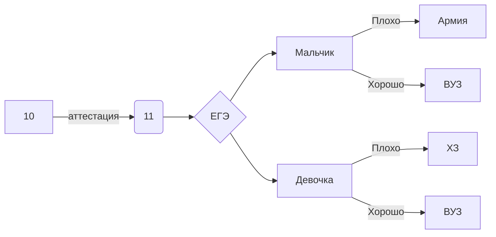

Воронин Вячеслав 122А группа.
__________________________________________

Все необходимые классные работы:
__________________________________________

1) Программы на пайтоне/BasaData.py - база данных в пайтоне с выбором запроса.
2) Программы на пайтоне/systemOfNumbers.py - 3 программы связанные с системами счисления: Перевод в десятичную, из десятичной и таблица перевода.
3) Программы на пайтоне/Морза.py - Перевод в азбуку Морза.
4) Office program/ВСЕ по Экселю.xlsx - Все работы по экселю.
5) Grafics/Tree1,
   Grafics/Tree2,
   Grafics/Tree3,
   Grafics/Tree4,
   Grafics/Tree5 - домашнее задание по библиотеке с черепахой в пайтоне.
6) Grafics/Paporatnic.py - лист папоратника на библиотеке с черепахой.
7) Grafics/EGE.py - Задание ЕГЭ выполненное библиотекой с черепахой в пайтоне.
8) CodeHeminga.ipynb - Код Хемминга в Google Colab.
9) https://openprocessing.org/user/342850/?view=sketches&o=2 - ссылка на опенпроцессинг.
10) Программы на пайтоне/Python_CPlusPlus.py - Все знания на Python.
11) Office program/Логика.xlsx - Математическая логика, в экселе.
12) Программы на пайтоне/MatLog - Математическая логика, на С++.
13) Фото нейронки.png - фото с обучением нейронной сети.
14) Программы на пайтоне/ЕГЭ по таблице истинности xywz.py - ЕГЭ задача по таблице истинности.
15) https://codepen.io/VoroninVaycheslav - ссылка на CodePen.
16) https://com2843.wordpress.com/ - ссылка на сайт WorldPress
17) База Данных.md - база данных с тренажёр.
18) Законы логики 15 формула приведения(Законы поглащения):
$$A\wedge_{}^{}(A\vee_{}^{}B)=A$$

19) какая-то формула:
$$\bar{E_0^{2}} = \sqrt[2]{\frac{F a_0^{2}}{(x-1)\cdot x } }+a_1^{2}+\beta_1^{2}$$

20) Мотивация/creatVideo.py - создание видео с мотивацией
21) Жесткий смайлик

22)Тест.cpp - Тест на знанию языка
23)VoroninSite.zip - проект на Flask
24)Мой жизненный цикл:

25) Проект сделаннай по генерации имен (VseSdelalTimur.py)

| Номер задачи | её готовность |
| ------ | ------ |
| 1 | 58 |
| 2 | 45 |
| 3 | + |
| 4 | - |
| 5 | - |
| 6| - |
| 7 |- |
| 8 |- |
| 9 |- |
| 10 |- |
| 11 |- |
| 12 |- |
| 13 |- |
| 14 |- |
| 15 |- |
| 16 |- |
| 17 |- |
| 18 |- |
| 19 | 64 |
| 20 | 32, 63 |
| 21 | 62 |
