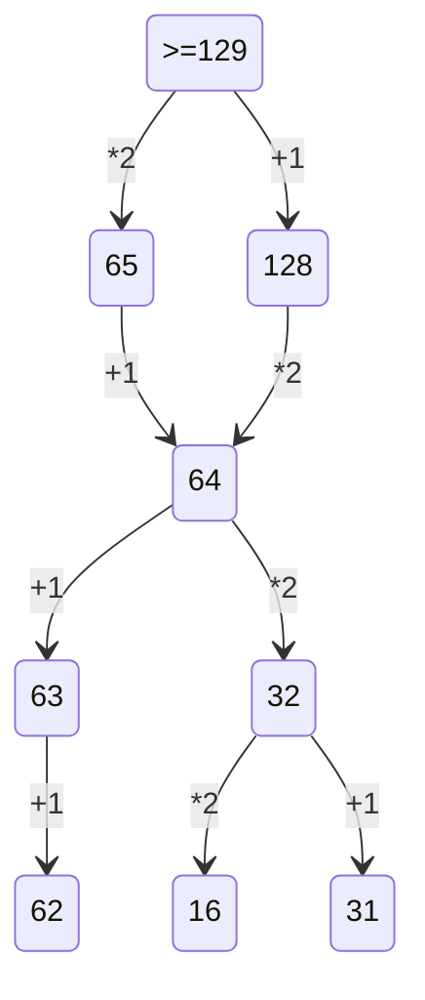

2 Заданеи:
очень легко, просто запомнить логику

1) Сгенерировать все возможные сочетания переменных. много вложенных циклов
2) Проверить логическую функцию на условие, проверить её на лож.

3 Задание: фильтруй все столбци таблици.

4 Задание:
1) Построить бинарное дерево с известными данными.
2) Определить количесвтво нужных символов для кодировк.
3) начать кодировку с минимального набора с минимального кода.
4) берем минимальный код и смотрим оставшихся вариантов хватает, чтобы закрыть все симолы, ели их не хваитет для кодирования символа, то увеличиваем длину кода.

10 Заданеи:
Итак, для начала нажимаем ctrl+f, в word появляется расширенный поиск, где нужно указать нужные параметры поискаи далее нам покажет, сколько раз это слово встречается в данном файле.

13 Задание:

19 Заданеи:

1) Нужно определить точку вход, условие ваыугрыша, сколько очков нужно наблать, чтобы завершить игру.
2) Рассписать двоичное дерево на 4 хода.
3) Ответить на вопрос задачи, присвоив какой ход, кто совершает.

