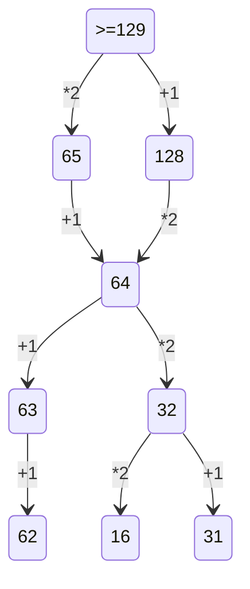

2 Заданеи:
1) Сгенерировать все возможные сочетания переменных. много вложенных циклов
2) Проверить логическую функцию на условие, проверить её на лож.


3 Задание: фильтруй все столбци таблици.


4 Задание:
1) Построить бинарное дерево с известными данными.
2) Определить количесвтво нужных символов для кодировк.
3) начать кодировку с минимального набора с минимального кода.
4) берем минимальный код и смотрим оставшихся вариантов хватает, чтобы закрыть все симолы, ели их не хваитет для кодирования символа, то увеличиваем длину кода.

5 Задание:
1) Организовать цикл перебора, с нуля до нужного числа.
2) Перевод в двоичную систему счисления (bin(), f'{N:B}').
3) Проверяем на условие дописывам и заменяем нужное.
4) Переводим в десячиную и проверяем на условия.

```python
for N in range(516):
    b = f'{N:b}' # bin(N)
    if N%2 == 0:
        b+='10'
    else:
        b = '1'+b+'10'
    
    if int(b,2) >516:
        print(b)
        break;
```       
6 Задание:
1) Вспомнит команды черепашки .
2) Нарисовать по алгоритму.
3) Подня перо, нарисовать точки.
4) Посчитать точки.

```python
from turtle import *
left(90)
for i in range(7):
    forward(300)
    right(120)
pu()
for x in range(1,9):
    for y in range(1,10):
        goto(x*30,y*30)
        dot(5)
done()
```   
8 Задание:
1) Генерируем все возможные варианты чисел.(for, product)
2) Проверяем строчку на условия.
10 Заданеи:
Итак, для начала нажимаем ctrl+f, в word появляется расширенный поиск, где нужно указать нужные параметры поискаи далее нам покажет, сколько раз это слово встречается в данном файле.
```python
from itertools import product
nums=product('01234567',repeat=5)
k=0
n='16 36 56 76 61 63 65 67'
nn=n.split()
for n in nums:
    numb=''.join(n)
    sp=[]
    if numb.count('6')==1 and numb[0]!='0':
        for x in nn:
            if x in numb:
                sp.append(x)
        if not sp: 
            k+=1
print(k)
```
13 Задание:
1) Накопительно нумеруем вершины графа, начиная с 1.
2) Суммируем все значаения или умножаем.
3) Выводим счетчик занчений.


Задание 14:
```python

a='0123456789abcde'
for x in a:
    f=int(f'123{x}5',15)+int(f'1{x}233',15)
    if  f%14 ==0:
        print(f//14)
        break

```
Задание 15:
```python

for a in range(1,1000):
    if all(((x%2==0) <= (x%3!=0)) or (x+a>=100) for x in range(1,100)):
        print(a)
        break

```
17 Задание:
```python
def f17():
    with open('17.txt') as f:
        a=[int(x) for x in f]
    mn=min(x for x in a if x % 17==0)
    maxi = -10
    count = 0
    for i in range(len(a)-1):
        if a[i]%mn ==0 or a[i+1]%mn == 0:
            sum = a[i+1]+a[i]
            count +=1
            if maxi < sum:
                maxi = sum
    print(maxi,count)
f17()
```
19 Заданеи:


1) Нужно определить точку вход, условие ваыугрыша, сколько очков нужно наблать, чтобы завершить игру.
2) Рассписать двоичное дерево на 4 хода.
3) Ответить на вопрос задачи, присвоив какой ход, кто совершает.


23 Задание:

1) С помощью функции продукт сформировать объект со всеми комбинациями искомой строки.
2) Перебор в совокупности программ.
3) Приводим стартовое положение в первоначальное состояние.
4) Используем команду для пропуска итерации не подходящих программ.
5) Заходим в саму программу.
6) Заходим в программу и анализируем команды.
7) Проверка на 17.
8) Если счетчик натыкается на значение которое нельзя допускать, то мы выходим из цикла и больше не работаем в этой программе, то есть переходим к следующей программе.
9) Проверяем счетчик на нужное значение.
10) Вывели полученное значение.
```python
from itertools import product
def f23(x,y,z):
    count=0
    for i in range(1,z):
        nums=product('12',repeat=i)
        for numb in nums:
            #numb=''.join(n)
            a=x
            if x==10 and numb.count('2')>1:continue
            for ii in numb:
                if a==17: break 
                if ii=='1':a+=1
                elif ii=='2' :a*=2

            if a==y: count+=1
    return count
                
print(f23(1,10,10)*f23(10,35,25))

```
```python
def f(x,y):
    if x >y or x == 17: return 0
    elif x ==y: return 1
    return f(x+1,y)+f(x*2,y)
    
print(f(1,10)*f(10,35))
```


