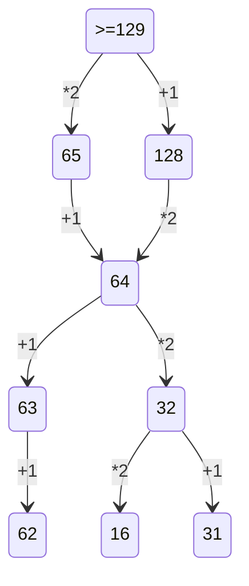

2 Заданеи:
1) Сгенерировать все возможные сочетания переменных. много вложенных циклов
2) Проверить логическую функцию на условие, проверить её на лож.


3 Задание: фильтруй все столбци таблици.


4 Задание:
1) Построить бинарное дерево с известными данными.
2) Определить количесвтво нужных символов для кодировк.
3) начать кодировку с минимального набора с минимального кода.
4) берем минимальный код и смотрим оставшихся вариантов хватает, чтобы закрыть все симолы, ели их не хваитет для кодирования символа, то увеличиваем длину кода.

5 Задание:
1) Организовать цикл перебора, с нуля до нужного числа.
2) Перевод в двоичную систему счисления (bin(), f'{N:B}').
3) Проверяем на условие дописывам и заменяем нужное.
4) Переводим в десячиную и проверяем на условия.

```python
for N in range(516):
    b = f'{N:b}' // bin(N)
    if N%2 == 0:
        b+='10'
    else:
        b = '1'+b+'10'
    
    if int(b,2) >516:
        print(b)
        break;
```       
10 Заданеи:
Итак, для начала нажимаем ctrl+f, в word появляется расширенный поиск, где нужно указать нужные параметры поискаи далее нам покажет, сколько раз это слово встречается в данном файле.

13 Задание:
1) Накопительно нумеруем вершины графа, начиная с 1.
2) Суммируем все значаения или умножаем.


19 Заданеи:


1) Нужно определить точку вход, условие ваыугрыша, сколько очков нужно наблать, чтобы завершить игру.
2) Рассписать двоичное дерево на 4 хода.
3) Ответить на вопрос задачи, присвоив какой ход, кто совершает.



